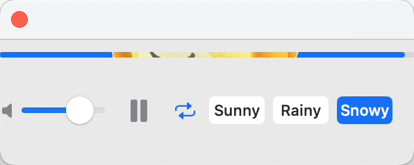

# NookPlayer

<p align="center">
    
</p>

NookPlayer 是一个简约的 macOS 音乐播放器，灵感来自于动物森友会游戏中的音乐系统。它会根据当前时间和`用户选择的天气状态`自动播放相应的背景音乐。


## 安装

1. 下载最新版本的 NookPlayer.app
2. 将应用拖入 Applications 文件夹
3. 双击运行即可

## 开发环境要求

- macOS 11.0 或更高版本
- Xcode 13.0 或更高版本
- Swift 5.5 或更高版本

## 构建方法

```bash
# 使用 Swift Package Manager 构建
cd NookPlayer
swift build -c release

# 或使用 make 命令构建
make build

# 安装到应用程序文件夹
make install
```
## 音乐文件要求

请前往 [网易云音乐专辑页面](https://music.163.com/album?id=86816962&userid=266593691) 下载全部歌曲。下载完成后，将音乐文件放置在 `Resources/Musics` 目录下即可。

## 已知问题
<p align="center">
    
</p>

 - 西施惠还不能正常显示在进度条中
 - 界面有点丑，第一次做swift开发还在摸索中

## TODO

 - [ ] 添加天气自动同步功能
 - [ ] 实现系统托盘图标支持
 - [ ] 优化进度条动画效果
 - [ ] 或许可以根据corelocation api还有weather kit自动获取天气？

## 贡献

欢迎提交 Pull Requests 和 Issues！在提交之前，请确保：

1. 代码符合项目的代码风格
2. 新功能包含适当的测试
3. 所有测试都能通过
4. 更新相关文档

## 许可证
MIT